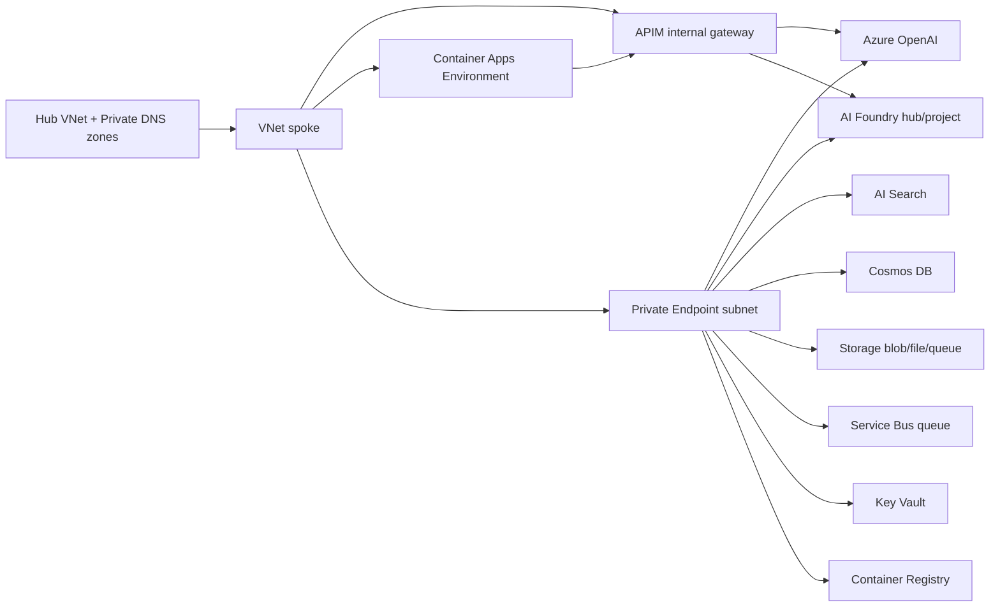

# Terraform AVM pattern: AI Foundry Citadel

This module deploys a private-by-default Azure AI Foundry "Citadel" landing-zone pattern:

- Azure AI Foundry hub and project using AzAPI (`Microsoft.MachineLearningServices/workspaces@2024-10-01-preview`)
- Azure OpenAI account and deployments
- **OPTIONAL:** API Management gateway in classic internal VNet mode (`Developer_1` for non-prod, `Premium_2` with zones for prod) — controlled by `gateway_mode` variable
- Azure Container Apps managed environment and e2e job
- Azure AI Search, Cosmos DB, Key Vault, Azure Container Registry, Service Bus, and a StorageV2 account with blob, file, and queue private endpoints
- Spoke VNet, NSGs, and carved subnets for APIM, ACA, private endpoints, App Gateway, and integration
- Log Analytics workspace and Application Insights

The module does **not** create hub Private DNS zones, hub peering, Azure Policy, AVNM configuration, or broad RBAC/governance assignments. Consumers provide existing Private DNS zone IDs and handle platform governance outside this module.

## Gateway Modes

The module supports **two deployment architectures** via the `gateway_mode` variable:

### Mode 1: Bundled (Default)

**`gateway_mode = "bundled"`** (default)

Deploys a **self-contained** AI Foundry platform with its own internal APIM gateway. All components (gateway + backend) are deployed together in a single module call.

```
Client → Internal APIM (apim-<name>-<env>-<location>)
         ↓
         AOAI + AI Foundry Hub/Project
```

**Use when:**
- You want a simple, self-contained deployment
- You don't need centralized gateway governance across multiple foundry instances
- You're deploying a single foundry use case

**Example:**
```hcl
module "citadel" {
  source = "github.com/martinopedal/terraform-azurerm-avm-ptn-aifoundry-citadel?ref=v0.3.0"

  name_prefix         = "foundry"
  environment         = "dev"
  location            = "swedencentral"
  gateway_mode        = "bundled"  # Explicit (or omit, this is default)
  
  # ... other required variables
}
```

### Mode 2: Citadel-Front (Separated)

**`gateway_mode = "citadel-front"`**

Deploys **backend-only** (AOAI + AI Foundry + data + compute), **no internal APIM**. Designed to be fronted by an **external Citadel AI Hub Gateway** deployed separately via `terraform-azurerm-avm-ptn-aifoundry-citadel-gateway` module.

```
Client → External Citadel Gateway (apim-citadel-<location>)
         ↓
         Multiple Foundry Backends (AOAI + AI Foundry)
```

**Use when:**
- You have multiple foundry instances and want a single centralized gateway
- You need centralized governance, cost tracking, and routing across all backends
- You want to separate gateway lifecycle from backend lifecycle

**Example:**
```hcl
# 1. Deploy foundry backend (no internal APIM)
module "foundry_backend" {
  source = "github.com/martinopedal/terraform-azurerm-avm-ptn-aifoundry-citadel?ref=v0.3.0"

  name_prefix         = "foundry"
  environment         = "dev"
  location            = "swedencentral"
  gateway_mode        = "citadel-front"  # Backend-only
  
  # ... other required variables
}

# 2. Deploy external Citadel gateway (separately)
module "citadel_gateway" {
  source = "github.com/martinopedal/terraform-azurerm-avm-ptn-aifoundry-citadel-gateway?ref=v0.2.0"

  location            = "swedencentral"
  # Wire to foundry backend via outputs
  existing_aoai_endpoint           = module.foundry_backend.aoai_endpoint
  existing_foundry_project_endpoint = module.foundry_backend.foundry_project_endpoint
  
  # ... other gateway config
}
```

**Outputs for wiring:**
When `gateway_mode = "citadel-front"`, the module outputs:
- `aoai_endpoint` — AOAI endpoint URL for gateway backend configuration
- `foundry_project_endpoint` — AI Foundry project endpoint for gateway backend configuration
- `apim_id`, `apim_name`, `apim_gateway_url`, `apim_principal_id` — All **null** (no internal APIM deployed)

## Naming/provider rationale

Repository name: `terraform-azurerm-avm-ptn-aifoundry-citadel`.

Although the Foundry hub/project and some preview child resources stay on AzAPI, the pattern is mostly composed from Azure Verified Modules in the `azurerm` ecosystem. The Terraform Registry provider segment is therefore `azurerm`.

## Architecture



## Usage

```hcl
module "citadel" {
  source = "github.com/martinopedal/terraform-azurerm-avm-ptn-aifoundry-citadel?ref=v0.1.0"

  name_prefix         = "citadel"
  environment         = "dev"
  location            = "swedencentral"
  spoke_address_space = "10.16.4.0/24"

  private_dns_zone_ids = {
    "privatelink.api.azureml.ms"         = azurerm_private_dns_zone.api_azureml.id
    "privatelink.azurecr.io"             = azurerm_private_dns_zone.acr.id
    "privatelink.blob.core.windows.net"  = azurerm_private_dns_zone.blob.id
    "privatelink.documents.azure.com"    = azurerm_private_dns_zone.cosmos.id
    "privatelink.file.core.windows.net"  = azurerm_private_dns_zone.file.id
    "privatelink.notebooks.azure.net"    = azurerm_private_dns_zone.notebooks.id
    "privatelink.openai.azure.com"       = azurerm_private_dns_zone.openai.id
    "privatelink.queue.core.windows.net" = azurerm_private_dns_zone.queue.id
    "privatelink.search.windows.net"     = azurerm_private_dns_zone.search.id
    "privatelink.servicebus.windows.net" = azurerm_private_dns_zone.servicebus.id
    "privatelink.vaultcore.azure.net"    = azurerm_private_dns_zone.vault.id
  }

  tags = {
    workload  = "aifoundry"
    managedBy = "terraform"
  }
}
```

See `examples/default` for a complete syntactic example.

## Network egress requirements

Force-tunneled ALZ spokes route residual AI Foundry, Azure OpenAI, portal callback, model artifact, and shared Azure control-plane egress through the hub Azure Firewall. Open the workload-specific FQDNs in [EGRESS.md](EGRESS.md) before deploying private Citadel spokes; private endpoints remain the primary path for data services, but they do not cover every Foundry/AOAI control-plane or artifact flow.

The canonical implemented firewall source for this estate is `alz-firewall-ops/FIREWALL-EGRESS-IMPLEMENTED.md`.

## Cost & Tiers

**Baseline cost (cheap default):**
- Model deployment: single `gpt-4o-mini` (Standard, 10K TPM) = pay-per-token, minimal baseline (~$0.15/$0.60 per 1M tokens in/out)
- Network security: private-by-default (private endpoints ~$7.30/mo each × 8 = ~$58/mo)
- Storage/Log retention: 30 days
- No zone redundancy, no customer-managed keys

**Opt-in hardening/scale levers:**
1. **MODELS** (`aoai_deployments`): Add more models, upgrade to `Provisioned` SKU for reserved throughput (PTU pricing, expensive), or use `GlobalStandard` for global routing (similar cost to Standard).
2. **SECURITY**:
   - `public_network_access_enabled = true` — allow public access (not recommended; violates ALZ demo-private-by-default policy).
   - The ACR Tasks integration subnet keeps Azure default outbound access enabled so the ACR-managed agent-pool bootstrap can reach required control-plane endpoints; workload services remain private-endpoint-first.
   - `disable_local_auth = false` — allow shared-key auth (legacy, not recommended).
   - `enable_cmk = true` — customer-managed encryption keys (requires Key Vault Premium, adds complexity).
   - `enable_private_endpoints = false` — disable private endpoints (saves ~$51/mo, not recommended for production).
3. **RELIABILITY**:
   - `enable_zone_redundancy = true` — zone redundancy for ACA (+50% cost) and APIM Premium (included in SKU). Note: AOAI and Foundry zone redundancy is region-dependent and not currently configured by this module.
   - `diagnostic_retention_days = 90` (or 180, 365) — longer retention for compliance (incurs additional storage cost).

**SKU couplings:**
- Zone redundancy for APIM requires `environment = "prod"` (Premium_2 SKU); Developer_1 does not support zones.
- Customer-managed keys require Key Vault Premium SKU (the module does not currently provision CMK wiring; this is a future enhancement).

## Inputs

| Name | Type | Default | Description |
|---|---:|---:|---|
| `environment` | `string` | `"dev"` | Environment name: `dev`, `test`, or `prod`. Drives APIM and service SKUs. |
| `location` | `string` | `"swedencentral"` | Azure region. |
| `name_prefix` | `string` | `"citadel"` | Short prefix for resource names. |
| `resource_group_names` | `object` | `{}` | Optional names for network/platform/gateway/compute resource groups. |
| `spoke_address_space` | `string` | `"10.16.4.0/24"` | Spoke CIDR carved into APIM, ACA, PE, AGW, and integration subnets. |
| `hub_vnet_resource_id` | `string` | `null` | Optional hub VNet ID for external coordination. No peering is created by this module. |
| `private_dns_zone_ids` | `map(string)` | n/a | Existing hub-managed Private DNS zones keyed by zone name. |
| `tags` | `map(string)` | `{}` | Tags applied to resources. |
| `network_group_tag` | `string` | `null` | Optional `network-group` tag value for tag-driven AVNM membership. |
| `enable_telemetry` | `bool` | `true` | Passed to all consumed AVM modules. |
| `git_sha` | `string` | `"latest"` | Placeholder container image tag. |
| **`aoai_deployments`** | `list(object)` | single `gpt-4o-mini` | AOAI model deployments (name, model, version, sku_type, capacity). Default = cheap baseline. |
| **`enable_private_endpoints`** | `bool` | `true` | Enable private endpoints for all services. Default true (private-by-default ALZ posture). |
| **`public_network_access_enabled`** | `bool` | `false` | Allow public network access to Foundry and AOAI. Default false (ALZ demo default). |
| **`disable_local_auth`** | `bool` | `true` | Disable shared-key auth on AOAI (AAD-only). Recommended for production. |
| **`enable_cmk`** | `bool` | `false` | Enable customer-managed key encryption (requires Key Vault Premium, not yet wired). |
| **`enable_zone_redundancy`** | `bool` | `false` | Enable zone redundancy for ACA and APIM Premium. Default false (cheap). |
| **`diagnostic_retention_days`** | `number` | `30` | Diagnostic log retention in days. Default 30 (cheap). Increase for compliance. |

## Outputs

Key outputs include resource group names, VNet/subnet IDs, data-plane resource IDs, Service Bus FQDN/queue, Storage Queue endpoint/name, Azure OpenAI endpoint, Foundry project endpoint, APIM gateway URL and principal ID, ACA environment ID, and runtime UAMI client IDs.

## AVM modules consumed

| Area | AVM module | Version |
|---|---|---:|
| VNet/subnets | `Azure/avm-res-network-virtualnetwork/azurerm` | `0.17.1` |
| Private endpoint (Foundry hub) | `Azure/avm-res-network-privateendpoint/azurerm` | `0.2.0` |
| Key Vault | `Azure/avm-res-keyvault-vault/azurerm` | `0.10.2` |
| Storage account + blob/file/queue PEs | `Azure/avm-res-storage-storageaccount/azurerm` | `0.7.2` |
| Service Bus namespace + queue + PE | `Azure/avm-res-servicebus-namespace/azurerm` | `0.4.0` |
| Container Registry | `Azure/avm-res-containerregistry-registry/azurerm` | `0.5.1` |
| Cosmos DB | `Azure/avm-res-documentdb-databaseaccount/azurerm` | `0.10.0` |
| AI Search | `Azure/avm-res-search-searchservice/azurerm` | `0.2.0` |
| Log Analytics | `Azure/avm-res-operationalinsights-workspace/azurerm` | `0.5.1` |
| Application Insights | `Azure/avm-res-insights-component/azurerm` | `0.4.0` |
| Azure OpenAI | `Azure/avm-res-cognitiveservices-account/azurerm` | `0.11.0` |
| API Management | `Azure/avm-res-apimanagement-service/azurerm` | `0.9.0` |
| Container Apps Environment | `Azure/avm-res-app-managedenvironment/azurerm` | `0.5.0` |

## AzAPI kept intentionally

- AI Foundry hub/project and project connection remain `azapi_resource` because the current azurerm and AVM surfaces do not expose the required hub/project `kind`, associated resource contract, and managed network settings.
- ACR agent pool remains AzAPI because the ACR AVM does not expose registry agent pools.

## License

MIT
