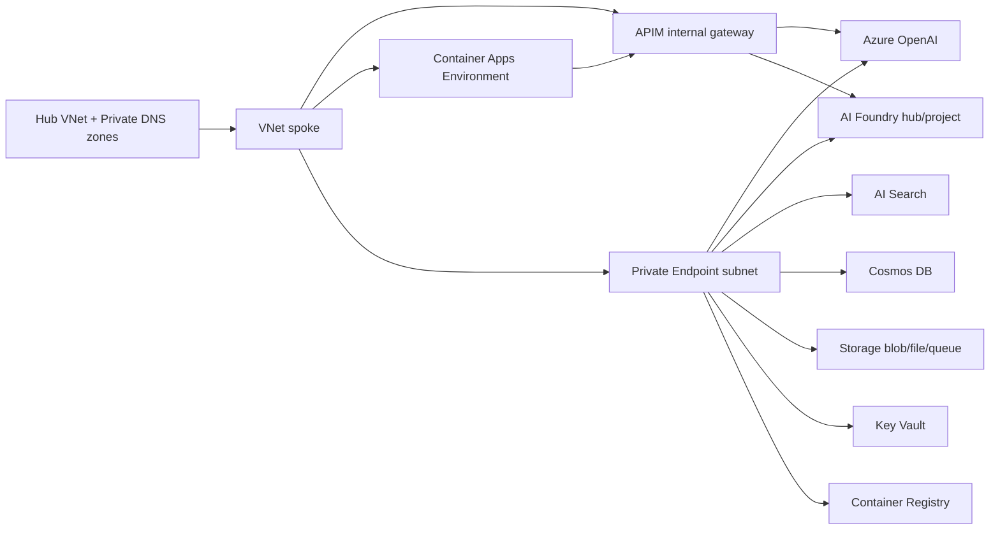

# Terraform AVM pattern: AI Foundry Citadel

This module deploys a private-by-default Azure AI Foundry "Citadel" landing-zone pattern:

- Azure AI Foundry hub and project using AzAPI (`Microsoft.MachineLearningServices/workspaces@2024-10-01-preview`)
- Azure OpenAI account and deployments
- **OPTIONAL:** API Management gateway in classic internal VNet mode (`Developer_1` for non-prod, `Premium_2` with zones for prod) — controlled by `gateway_mode` variable
- Azure Container Apps managed environment and e2e job
- Azure AI Search, Cosmos DB, Key Vault, Azure Container Registry, and a StorageV2 account with blob, file, and queue private endpoints
- Spoke VNet, NSGs, and carved subnets for APIM, ACA, private endpoints, App Gateway, and integration
- Log Analytics workspace and Application Insights

The module does **not** create hub Private DNS zones, hub peering, Azure Policy, AVNM configuration, or broad RBAC/governance assignments. Consumers provide existing Private DNS zone IDs and handle platform governance outside this module.

## Gateway Modes

The module supports **two deployment architectures** via the `gateway_mode` variable:

### Mode 1: Bundled (Default)

**`gateway_mode = "bundled"`** (default)

Deploys a **self-contained** AI Foundry platform with its own internal APIM gateway. All components (gateway + backend) are deployed together in a single module call.

```
Client → Internal APIM (apim-<name>-<env>-<location>)
         ↓
         AOAI + AI Foundry Hub/Project
```

**Use when:**
- You want a simple, self-contained deployment
- You don't need centralized gateway governance across multiple foundry instances
- You're deploying a single foundry use case

**Example:**
```hcl
module "citadel" {
  source = "github.com/martinopedal/terraform-azurerm-avm-ptn-aifoundry-citadel?ref=v0.3.0"

  name_prefix         = "foundry"
  environment         = "dev"
  location            = "swedencentral"
  gateway_mode        = "bundled"  # Explicit (or omit, this is default)
  
  # ... other required variables
}
```

### Mode 2: Citadel-Front (Separated)

**`gateway_mode = "citadel-front"`**

Deploys **backend-only** (AOAI + AI Foundry + data + compute), **no internal APIM**. Designed to be fronted by an **external Citadel AI Hub Gateway** deployed separately via `terraform-azurerm-avm-ptn-aifoundry-citadel-gateway` module.

```
Client → External Citadel Gateway (apim-citadel-<location>)
         ↓
         Multiple Foundry Backends (AOAI + AI Foundry)
```

**Use when:**
- You have multiple foundry instances and want a single centralized gateway
- You need centralized governance, cost tracking, and routing across all backends
- You want to separate gateway lifecycle from backend lifecycle

**Example:**
```hcl
# 1. Deploy foundry backend (no internal APIM)
module "foundry_backend" {
  source = "github.com/martinopedal/terraform-azurerm-avm-ptn-aifoundry-citadel?ref=v0.3.0"

  name_prefix         = "foundry"
  environment         = "dev"
  location            = "swedencentral"
  gateway_mode        = "citadel-front"  # Backend-only
  
  # ... other required variables
}

# 2. Deploy external Citadel gateway (separately)
module "citadel_gateway" {
  source = "github.com/martinopedal/terraform-azurerm-avm-ptn-aifoundry-citadel-gateway?ref=v0.2.0"

  location            = "swedencentral"
  # Wire to foundry backend via outputs
  existing_aoai_endpoint           = module.foundry_backend.aoai_endpoint
  existing_foundry_project_endpoint = module.foundry_backend.foundry_project_endpoint
  
  # ... other gateway config
}
```

**Outputs for wiring:**
When `gateway_mode = "citadel-front"`, the module outputs:
- `aoai_endpoint` — AOAI endpoint URL for gateway backend configuration
- `foundry_project_endpoint` — AI Foundry project endpoint for gateway backend configuration
- `apim_id`, `apim_name`, `apim_gateway_url`, `apim_principal_id` — All **null** (no internal APIM deployed)

## Naming/provider rationale

Repository name: `terraform-azurerm-avm-ptn-aifoundry-citadel`.

Although the Foundry hub/project and some preview child resources stay on AzAPI, the pattern is mostly composed from Azure Verified Modules in the `azurerm` ecosystem. The Terraform Registry provider segment is therefore `azurerm`.

## Architecture



## Usage

```hcl
module "citadel" {
  source = "github.com/martinopedal/terraform-azurerm-avm-ptn-aifoundry-citadel?ref=v0.1.0"

  name_prefix         = "citadel"
  environment         = "dev"
  location            = "swedencentral"
  spoke_address_space = "10.16.4.0/24"

  private_dns_zone_ids = {
    "privatelink.api.azureml.ms"         = azurerm_private_dns_zone.api_azureml.id
    "privatelink.azurecr.io"             = azurerm_private_dns_zone.acr.id
    "privatelink.blob.core.windows.net"  = azurerm_private_dns_zone.blob.id
    "privatelink.documents.azure.com"    = azurerm_private_dns_zone.cosmos.id
    "privatelink.file.core.windows.net"  = azurerm_private_dns_zone.file.id
    "privatelink.notebooks.azure.net"    = azurerm_private_dns_zone.notebooks.id
    "privatelink.openai.azure.com"       = azurerm_private_dns_zone.openai.id
    "privatelink.queue.core.windows.net" = azurerm_private_dns_zone.queue.id
    "privatelink.search.windows.net"     = azurerm_private_dns_zone.search.id
    "privatelink.vaultcore.azure.net"    = azurerm_private_dns_zone.vault.id
  }

  tags = {
    workload  = "aifoundry"
    managedBy = "terraform"
  }
}
```

See `examples/default` for a complete syntactic example.

## Inputs

| Name | Type | Default | Description |
|---|---:|---:|---|
| `environment` | `string` | `"dev"` | Environment name: `dev`, `test`, or `prod`. Drives APIM and service SKUs. |
| `location` | `string` | `"swedencentral"` | Azure region. |
| `name_prefix` | `string` | `"citadel"` | Short prefix for resource names. |
| `resource_group_names` | `object` | `{}` | Optional names for network/platform/gateway/compute resource groups. |
| `spoke_address_space` | `string` | `"10.16.4.0/24"` | Spoke CIDR carved into APIM, ACA, PE, AGW, and integration subnets. |
| `hub_vnet_resource_id` | `string` | `null` | Optional hub VNet ID for external coordination. No peering is created by this module. |
| `private_dns_zone_ids` | `map(string)` | n/a | Existing hub-managed Private DNS zones keyed by zone name. |
| `tags` | `map(string)` | `{}` | Tags applied to resources. |
| `network_group_tag` | `string` | `null` | Optional `network-group` tag value for tag-driven AVNM membership. |
| `enable_telemetry` | `bool` | `true` | Passed to all consumed AVM modules. |
| `git_sha` | `string` | `"latest"` | Placeholder container image tag. |

## Outputs

Key outputs include resource group names, VNet/subnet IDs, data-plane resource IDs, Storage Queue endpoint/name, Azure OpenAI endpoint, Foundry project endpoint, APIM gateway URL and principal ID, ACA environment ID, and runtime UAMI client IDs.

## AVM modules consumed

| Area | AVM module | Version |
|---|---|---:|
| VNet/subnets | `Azure/avm-res-network-virtualnetwork/azurerm` | `0.17.1` |
| Private endpoint (Foundry hub) | `Azure/avm-res-network-privateendpoint/azurerm` | `0.2.0` |
| Key Vault | `Azure/avm-res-keyvault-vault/azurerm` | `0.10.2` |
| Storage account + blob/file/queue PEs | `Azure/avm-res-storage-storageaccount/azurerm` | `0.7.2` |
| Container Registry | `Azure/avm-res-containerregistry-registry/azurerm` | `0.5.1` |
| Cosmos DB | `Azure/avm-res-documentdb-databaseaccount/azurerm` | `0.10.0` |
| AI Search | `Azure/avm-res-search-searchservice/azurerm` | `0.2.0` |
| Log Analytics | `Azure/avm-res-operationalinsights-workspace/azurerm` | `0.5.1` |
| Application Insights | `Azure/avm-res-insights-component/azurerm` | `0.4.0` |
| Azure OpenAI | `Azure/avm-res-cognitiveservices-account/azurerm` | `0.11.0` |
| API Management | `Azure/avm-res-apimanagement-service/azurerm` | `0.9.0` |
| Container Apps Environment | `Azure/avm-res-app-managedenvironment/azurerm` | `0.5.0` |

## AzAPI kept intentionally

- AI Foundry hub/project and project connection remain `azapi_resource` because the current azurerm and AVM surfaces do not expose the required hub/project `kind`, associated resource contract, and managed network settings.
- ACR agent pool remains AzAPI because the ACR AVM does not expose registry agent pools.

## License

MIT
